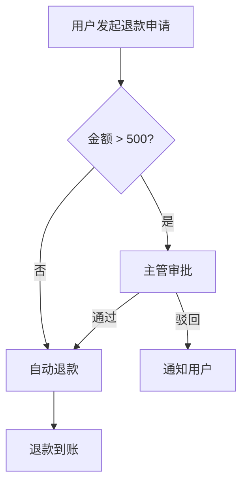

# BizFlow — 业务流程梳理助手

> 将 IM 聊天记录、会议纪要、语音转写、Markdown 文档等混合原始材料，**零写作**转化为结构化的业务流程文档和 BRD。

```
粘贴飞书聊天  ──→  流程文档（含 Mermaid 图）  ──→  BRD
粘贴会议纪要  ──↗                                    ↑
粘贴语音转写  ──↗     自动切块 → 提炼 → 确认 → 生成  ─┘
```

## 为什么需要 BizFlow

产品经理日常面对的原始材料散落在各处——飞书群聊、会议纪要、语音转写、随手写的文档。把这些混杂的信息整理成结构化的流程文档和 BRD，往往要花费大量时间。

BizFlow 让 AI 替你完成这件事：**你只负责粘贴原始材料，AI 完成全部结构化产出。**

## 核心特性

| 特性 | 说明 |
|------|------|
| **零写作** | 只需粘贴原始材料，不需要写任何文档 |
| **混合输入** | 支持聊天记录、会议纪要、语音转写、Markdown 文档混着贴 |
| **可溯源** | 每个结论都有来源引用，可追溯到原始聊天/文档 |
| **禁止脑补** | 不确定的一律标 `【待确认】`，绝不编造 |
| **IM 可秒回** | 确认清单专为飞书/企微/钉钉优化，业务方 10 秒内能回复 |
| **异常兜底** | 流程文档强制覆盖权限、超时、幂等、人工介入、对账 5 类异常 |
| **Mermaid 图表** | 主流程 flowchart、状态机 stateDiagram、时序 sequenceDiagram 自动生成 |
| **图片/视频感知** | 含媒体的材料自动标记，多模态 AI 可直接读图提取信息 |

## 工作流程

4 步闭环，可随时回到任意步骤迭代：

```
① 追加材料 (Append) → ② 提炼骨架 (Capture) → ③ 确认清单 (Confirm) → ④ 生成文档 (Run)
```

| 步骤 | 你做什么 | AI 做什么 |
|------|---------|----------|
| **Append** | 粘贴聊天记录/纪要/文档 | 自动识别类型、智能切块、索引 |
| **Capture** | 说"提炼流程" | 提取事实、识别冲突、生成流程骨架 + ≤10 个确认点 |
| **Confirm** | 说"生成确认清单" | 产出可直接发给业务方的 IM 消息稿 |
| **Run** | 说"生成 BRD" | 产出流程文档 + BRD + QA 门禁检查 |

## 产出物

```
outputs/
├── 01_process.md    # 业务流程文档（含 Mermaid 流程图 + 状态机）
└── 02_brd.md        # 业务需求文档（BRD）
```

流程文档示例结构：



## 安装

### Cursor

```bash
cp -r bizflow/ ~/.cursor/skills/bizflow/
```

### Claude Code

```bash
cp -r bizflow/ ~/.claude/skills/bizflow/
```

### 其他 AI 工具

将 `bizflow/SKILL.md` 的内容粘贴到工具的 Custom Instructions 或 System Prompt 中。如果工具支持多文件，也将 `bizflow/references/` 下的 4 个工作流文件一并导入。

## 快速开始

安装后，在 AI 对话中说：

```
帮我梳理「会员续费退款流程」
```

AI 会自动初始化项目并输出使用说明。然后你只需要：

1. **粘贴材料** — 把聊天记录/会议纪要/文档直接贴过来
2. **说"提炼流程"** — AI 生成流程骨架 + 需确认的问题
3. **说"生成确认清单"** — 拿到可直接发给业务方的 IM 消息
4. **说"生成 BRD"** — 一键产出最终文档

每一步完成后 AI 都会提示你下一步该做什么。

## Skill 文件结构

```
bizflow/
├── SKILL.md                          # 主文件：原则、工作流、Mermaid 规则、模板
└── references/
    ├── append-workflow.md            # Append 详细流程
    ├── capture-workflow.md           # Capture 详细流程
    ├── confirm-workflow.md           # Confirm 详细流程
    └── run-workflow.md               # Run 详细流程
```

另外，`bizflow.md` 是原始的 Claude Code slash command 版本（仅供参考）。

## 设计原则

- **唯一事实源**：所有原始材料集中在 `inputs/00_raw.md`，通过 EntryId 精确溯源
- **输出文件人类可读**：正文用 `[来源1]` 等短标记引用，文末附可读描述的引用表，不暴露内部编号
- **渐进式披露**：SKILL.md 放核心逻辑（<500 行），详细工作流在 references/ 目录按需加载
- **工具无关**：不绑定任何特定 AI 工具，只要求文件读写能力

## 许可

MIT
