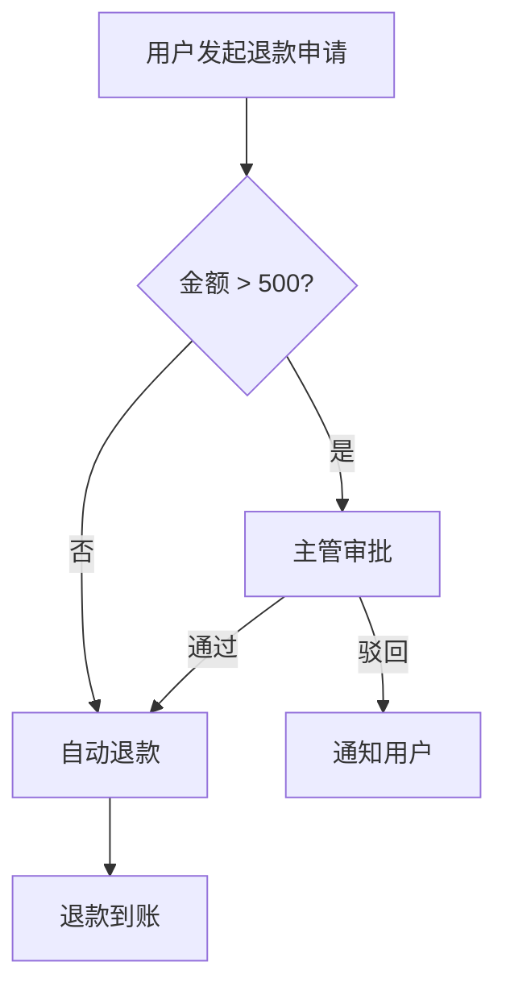

# BizFlow — 业务流程梳理助手

> 将 IM 聊天记录、会议纪要、语音转写、Markdown 文档等混合原始材料，**零写作**转化为结构化的业务流程文档和 BRD。

```
粘贴飞书聊天  ──→  流程文档（含 Mermaid 图）  ──→  BRD
粘贴会议纪要  ──↗                                    ↑
粘贴语音转写  ──↗     自动切块 → 提炼 → 确认 → 生成  ─┘
```

## 为什么需要 BizFlow

产品经理日常面对的原始材料散落在各处——飞书群聊、会议纪要、语音转写、随手写的文档。把这些混杂的信息整理成结构化的流程文档和 BRD，往往要花费大量时间。

BizFlow 让 AI 替你完成这件事：**你只负责粘贴原始材料，AI 完成全部结构化产出。**

## 核心特性

| 特性 | 说明 |
|------|------|
| **零写作** | 只需粘贴原始材料，不需要写任何文档 |
| **混合输入** | 支持聊天记录、会议纪要、语音转写、Markdown 文档混着贴 |
| **可溯源** | 每个结论都有来源引用，可追溯到原始聊天/文档 |
| **禁止脑补** | 不确定的一律标 `【待确认】`，绝不编造 |
| **IM 可秒回** | 确认清单专为飞书/企微/钉钉优化，业务方 10 秒内能回复 |
| **异常兜底** | 流程文档强制覆盖权限、超时、幂等、人工介入、对账 5 类异常 |
| **Mermaid 图表** | 主流程 flowchart、状态机 stateDiagram、时序 sequenceDiagram 自动生成 |
| **图片/视频感知** | 含媒体的材料自动标记，多模态 AI 可直接读图提取信息 |

## 工作流程

4 步闭环，可随时回到任意步骤迭代：

```
① 追加材料 (Append) → ② 提炼骨架 (Capture) → ③ 确认清单 (Confirm) → ④ 生成文档 (Run)
```

| 步骤 | 你做什么 | AI 做什么 |
|------|---------|----------|
| **Append** | 粘贴聊天记录/纪要/文档 | 自动识别类型、智能切块、索引 |
| **Capture** | 说"提炼流程" | 提取事实、识别冲突、生成流程骨架 + ≤10 个确认点 |
| **Confirm** | 说"生成确认清单" | 产出可直接发给业务方的 IM 消息稿 |
| **Run** | 说"生成 BRD" | 产出流程文档 + BRD + QA 门禁检查 |

## 产出物

```
outputs/
├── 01_process.md    # 业务流程文档（含 Mermaid 流程图 + 状态机）
└── 02_brd.md        # 业务需求文档（BRD）
```

流程文档示例结构：



## 安装与使用

先克隆仓库：

```bash
git clone https://github.com/dongtz/bizflow_skill.git
cd bizflow_skill
```

---

### Cursor

<details>
<summary><b>安装方法</b></summary>

将 `bizflow/` 目录复制到 Cursor 的个人 skills 目录：

```bash
cp -r bizflow/ ~/.cursor/skills/bizflow/
```

安装后 Cursor 会自动发现该 Skill，无需重启。

</details>

<details>
<summary><b>使用方法</b></summary>

在 Cursor 的 AI 对话框（`Cmd+L` 或 `Cmd+I`）中：

**方式一：直接说主题**
```
帮我梳理「会员续费退款流程」
```

**方式二：带着材料一起说**
```
帮我梳理退款流程，下面是聊天记录：

张三：退款需要走审批吗
李四：金额超过500要主管审批
...
```

**方式三：用 `@` 引用文件**
```
帮我梳理退款流程，材料在 @退款讨论.md 和 @会议纪要0210.md
```

AI 初始化后会输出使用说明卡片，然后按提示操作：
1. 粘贴材料（可多次）
2. 说"提炼流程"
3. 说"生成确认清单"
4. 说"生成 BRD"

每一步完成后 AI 都会提示下一步该做什么。

</details>

---

### Claude Code

<details>
<summary><b>安装方法</b></summary>

将 `bizflow/` 目录复制到 Claude Code 的个人 skills 目录：

```bash
cp -r bizflow/ ~/.claude/skills/bizflow/
```

安装后 Claude Code 会自动发现该 Skill，无需重启。

</details>

<details>
<summary><b>使用方法</b></summary>

在 Claude Code 终端中：

**启动**
```
帮我梳理「会员续费退款流程」
```

**追加材料**（支持多次，混着贴）
```
追加这些材料：

（直接粘贴飞书聊天记录 / 会议纪要 / Markdown 文档）
```

**后续步骤**（按 AI 提示依次执行）
```
提炼流程
```
```
生成确认清单
```
```
生成 BRD
```

Claude Code 也可以用 `@` 引用本地文件作为材料输入。

</details>

---

### Kimi Code CLI

<details>
<summary><b>安装方法</b></summary>

Kimi Code CLI 原生支持 SKILL.md 格式。将 `bizflow/` 目录复制到以下任一路径（按优先级排列）：

```bash
# 推荐：使用 ~/.kimi/skills/ 目录
cp -r bizflow/ ~/.kimi/skills/bizflow/
```

其他可选路径（Kimi 也会自动扫描）：
```bash
# 如果你同时使用 Claude Code，共用同一份即可
cp -r bizflow/ ~/.claude/skills/bizflow/
```

也可以通过 `--skills-dir` 参数指定自定义路径：
```bash
kimi --skills-dir /path/to/my-skills
```

安装后 Kimi 启动时会自动发现并注入该 Skill。

</details>

<details>
<summary><b>使用方法</b></summary>

在 Kimi Code CLI 中：

**启动**
```
帮我梳理「会员续费退款流程」
```

**追加材料**
```
追加这些材料：

（粘贴聊天记录 / 文档内容）
```

**后续步骤**
```
提炼流程
```
```
生成确认清单
```
```
生成 BRD
```

使用流程与 Claude Code 完全一致。

</details>

---

### 其他 AI 工具（ChatGPT / Gemini / 通义 / 豆包等）

<details>
<summary><b>安装方法</b></summary>

这些工具不支持 SKILL.md 文件格式，需要手动配置。

**方式一：Custom Instructions / System Prompt**

将 `bizflow/SKILL.md` 的**全部内容**（去掉开头的 YAML frontmatter `---...---`）粘贴到工具的：
- ChatGPT → Settings → Custom Instructions → "How would you like ChatGPT to respond?"
- Gemini → Gems → 创建新 Gem → Instructions
- 通义千问 → 我的助手 → 创建助手 → 系统提示词
- 豆包 → 创建智能体 → 系统提示词

**方式二：对话开头粘贴（无需配置）**

每次新对话时，先发送：
```
请严格按照以下 Skill 指令工作：

（粘贴 SKILL.md 全部内容）
```
然后正常使用。

> 注意：由于这些工具不支持文件读写，AI 会直接在对话中输出文档内容而非写入文件。你需要手动复制保存。

</details>

<details>
<summary><b>使用方法</b></summary>

**第 1 轮：启动 + 粘贴材料**
```
主题是「会员续费退款流程」，下面是原始材料：

（粘贴聊天记录 / 会议纪要 / 文档内容）
```

**第 2 轮：提炼流程**
```
提炼流程
```

**第 3 轮：生成确认清单**
```
生成确认清单
```

**第 4 轮：生成最终文档**
```
生成 BRD
```

每一步 AI 都会提示下一步操作。如果需要追加材料，说"追加材料"然后粘贴新内容。

</details>

---

### 安装方式速查

| 工具 | 安装命令 / 方式 | Skill 自动发现 | 文件读写 |
|------|----------------|:-----------:|:------:|
| **Cursor** | `cp -r bizflow/ ~/.cursor/skills/bizflow/` | ✅ | ✅ |
| **Claude Code** | `cp -r bizflow/ ~/.claude/skills/bizflow/` | ✅ | ✅ |
| **Kimi Code CLI** | `cp -r bizflow/ ~/.kimi/skills/bizflow/` | ✅ | ✅ |
| **ChatGPT / Gemini 等** | 粘贴 SKILL.md 到 Custom Instructions | ❌ 手动 | ❌ 对话输出 |

## Skill 文件结构

```
bizflow/
├── SKILL.md                          # 主文件：原则、工作流、Mermaid 规则、模板
└── references/
    ├── append-workflow.md            # Append 详细流程
    ├── capture-workflow.md           # Capture 详细流程
    ├── confirm-workflow.md           # Confirm 详细流程
    └── run-workflow.md               # Run 详细流程
```

另外，`bizflow.md` 是原始的 Claude Code slash command 版本（仅供参考）。

## 设计原则

- **唯一事实源**：所有原始材料集中在 `inputs/00_raw.md`，通过 EntryId 精确溯源
- **输出文件人类可读**：正文用 `[来源1]` 等短标记引用，文末附可读描述的引用表，不暴露内部编号
- **渐进式披露**：SKILL.md 放核心逻辑（<500 行），详细工作流在 references/ 目录按需加载
- **工具无关**：不绑定任何特定 AI 工具，只要求文件读写能力

## 许可

MIT
