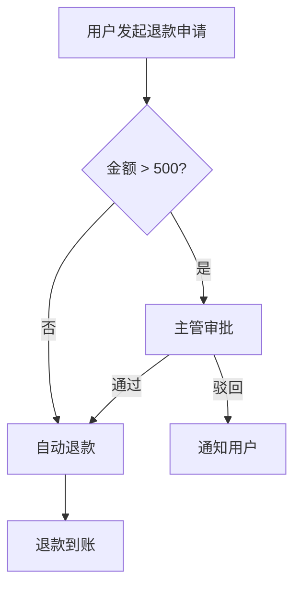
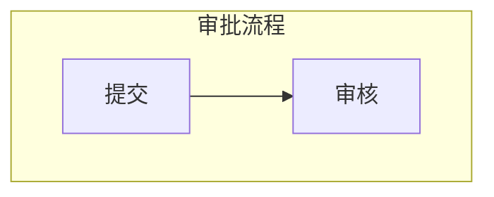
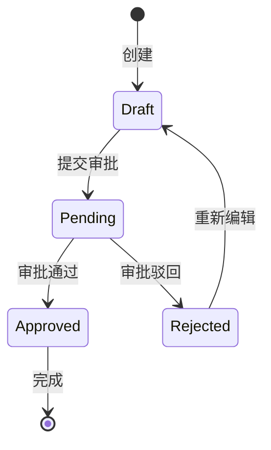
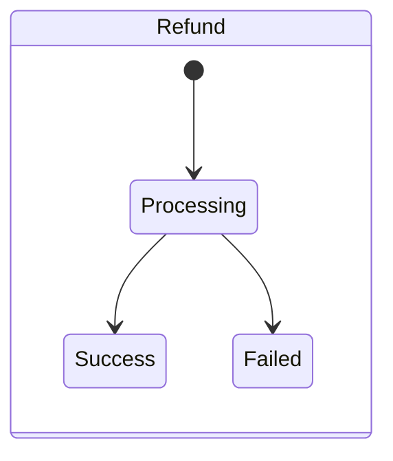
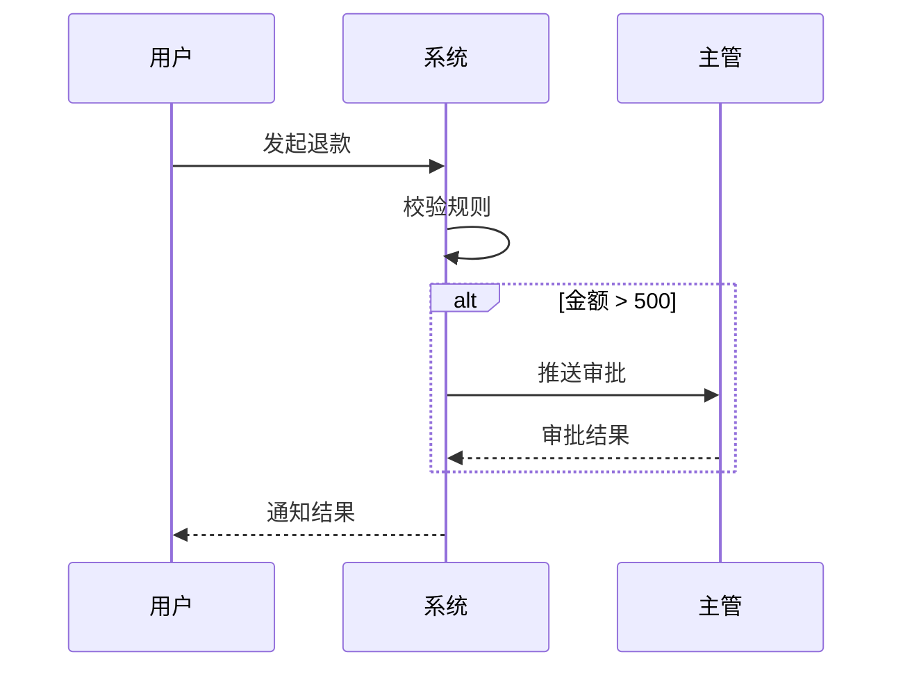

# 业务流程梳理助手（BizFlow）

将 IM 混合输入（聊天/纪要/语音转写/Markdown 文档）零写作转化为业务流程文档与 BRD。

## 核心理念

业务方不写文档。只提供原始材料，AI 助手完成全部结构化产出。

## 能力要求

此技能要求 AI 助手具备：文件读写、目录创建。无其他外部依赖。

---

## 项目结构

初始化时在工作目录下创建以下结构：

```
<project>/
├── inputs/
│   ├── 00_raw.md           # 唯一事实源：所有原始材料（已切块+索引）
│   └── 00_intake.md        # 提炼后的最小事实集（MIS）
├── research/
│   └── sources.md          # 合规/规范/口径引用来源
├── outputs/
│   ├── 01_process.md       # 业务流程文档
│   └── 02_brd.md           # 业务需求文档（BRD）
└── decisions.md            # 决策日志 + 未决项追溯
```

---

## 核心原则（强制）

### 输入原则

- `inputs/00_raw.md` 是**唯一事实源**（允许混杂：聊天、纪要、转写、Markdown 文档）
- **禁止脑补**：无法从原文确定的信息必须标注 `【待确认】` 并进入确认清单
- **冲突处理**：同一结论冲突时，标注冲突点 + 各自来源片段（以 EntryId 为依据）

### 输出门禁

- 确认点 ≤10，按优先级排列，改写为"IM 可秒回"格式（是/否 / A/B/C / 短填空 ≤10 字）
- `outputs/01_process.md` 必须覆盖异常最低集合：
  - 权限控制、超时/重试、重复提交/幂等、人工介入、对账/纠错
  - 按实际业务适配，不适用的注明理由
- 合规/规范/口径：写入 `research/sources.md` 并在文档中引用；缺失则标 `【待补引用】`
- **图表使用 Mermaid 渲染**（强制）：
  - 主流程 → `flowchart TD`
  - 状态机/生命周期 → `stateDiagram-v2`
  - 角色交互/时序 → `sequenceDiagram`（如适用）
  - 所有 Mermaid 代码必须通过语法自检（见下方 Mermaid 语法规则）

### EntryId 溯源体系

每条切块分配唯一 ID：`YYYYMMDD-HHMM-XXX`（XXX = 当日递增 3 位序号）。

**内部文件 vs 输出文件的引用方式不同（强制）：**

| 文件类型 | 引用方式 | 示例 |
|---------|---------|------|
| **内部文件**（inputs/、decisions.md） | 直接写 EntryId | `EntryId: 20260211-1430-003` |
| **输出文件**（outputs/01_process.md、02_brd.md） | 用 `[来源N]` 标记 + 文末引用表 | 正文写 `[来源1]`，文末映射到可读描述 |

**输出文件的引用规则：**
- 正文中用 `[来源1]`、`[来源2]` 等短标记，不出现 EntryId 原始编号
- 文档末尾（§8 引用与依据）放引用表，每条包含：
  - 可读描述（自动从 Entry 元数据生成：来源类型 + 关键人/文档名 + 日期 + 主题关键词）
  - EntryId（仅供内部溯源，放在描述后方括号内）
- 描述生成规则：

| SourceType | 描述格式 | 示例 |
|------------|---------|------|
| Chat | `<关键词/发言人> 的聊天记录（<日期>）` | 李四关于退款审批的聊天记录（2/11） |
| Minutes | `<DocTitle> — <SectionTitle>（<日期>）` | 退款流程对齐会 — 审批规则（2/10） |
| Transcript | `<DocTitle> 语音转写（<日期>）` | 产品需求评审 语音转写（2/9） |
| MarkdownDoc | `<DocTitle> — <SectionTitle>（<日期>）` | 退款规范文档 — 到账时限（2/8） |
| Other | `补充材料（<日期>）` | 补充材料（2/11） |

---

## 工作流（四步闭环）

```
追加材料 (Append) → 提炼骨架 (Capture) → 确认清单 (Confirm) → 生成文档 (Run)
```

用户可随时重复任意步骤（如多次 Append 后再 Capture）。

### 步骤衔接提示（强制）

**每个步骤执行完毕后，必须向用户输出「下一步提示」**，格式固定：

```
---
✅ <当前步骤名称> 完成
   <一句话概括本步产出>

👉 下一步：<下一步名称>
   <告诉用户该做什么 + 示例用语>

💡 你也可以：
   - <可选操作 1>
   - <可选操作 2>
---
```

各步骤的具体下一步提示见对应参考文件末尾。

### 步骤 1：初始化 (Init)

触发时机：首次使用或项目目录不存在时自动执行。

1. 创建上述项目结构中的所有目录和空文件
2. 在 `decisions.md` 写入初始化记录：
   ```
   # 决策日志
   ## 初始化
   - 主题：<用户提供的主题>
   - 创建时间：<当前时间>
   - 工作流：Append → Capture → Confirm → Run
   ```
3. **向用户输出使用说明卡片（必须，原样输出）：**

```
📋 BizFlow 已就绪 — 主题：「<主题>」

你只需要做一件事：粘贴原始材料。其余全部由我完成。

🔄 工作流程（4 步闭环）：
┌─────────────────────────────────────────────────┐
│ ① 追加材料 → ② 提炼流程 → ③ 确认清单 → ④ 生成BRD │
└─────────────────────────────────────────────────┘

📌 怎么用：
• 粘贴材料 — 直接贴聊天记录/会议纪要/文档，混着贴就行，可以分多次贴
• 提炼流程 — 说"提炼流程"，我会生成流程骨架 + 需确认的问题
• 生成清单 — 说"生成确认清单"，产出可直接发给业务方的 IM 消息
• 生成文档 — 说"生成 BRD"，一键产出流程文档 + BRD

⚡ 特性：所有结论可溯源 | 不确定标【待确认】| 确认清单可秒回 | 异常场景自动兜底

👉 现在请粘贴你的第一批原始材料（聊天记录/会议纪要/文档，混着贴就行）
```

### 步骤 2：追加材料 (Append)

将混合原始内容（IM 聊天 + Markdown 文档 + 会议纪要 + 语音转写）追加到 `inputs/00_raw.md`，自动切块、索引。

**详细流程参见 [references/append-workflow.md](references/append-workflow.md)**

核心要点：
- 自动识别内容类型（MarkdownDoc / Chat / Minutes / Transcript / Other）
- 按文档章节、发言人、时间戳智能切块
- 保护不可拆分单元：代码块 + 媒体块（图片/视频及其上下文说明）
- 支持"Markdown 内聊天二次拆分"
- 图片/视频引用原样保留，Entry 元数据标记 `[Media]: img:N, video:M`
- 维护文件头部索引目录（Raw Index 表，含 Media 列）
- 每次追加后在 `decisions.md` 记录本次输入概况

### 步骤 3：提炼骨架 (Capture)

从 `inputs/00_raw.md` 中提取最小事实集（MIS），生成流程骨架与确认点。

**详细流程参见 [references/capture-workflow.md](references/capture-workflow.md)**

核心要点：
- 默认分析最新 80 条 Entry（可调整：`last=50/120` 等）
- 区分事实 vs 观点，提取实体要素（角色/系统/数据对象/动作/阈值）
- 冲突识别 + 旧证据拉取（最多额外 10 条）
- 产出 `inputs/00_intake.md`（MIS）和 `outputs/01_process.md`（可讨论版）
- Open Questions ≤10，均可秒回

### 步骤 4：确认清单 (Confirm)

将确认点转为业务方可在 IM 中秒回的确认消息。

**详细流程参见 [references/confirm-workflow.md](references/confirm-workflow.md)**

核心要点：
- 产出"可直接复制发送的 IM 消息稿"
- 每条用 #1~#N 编号，给出回复示例（如"#2 选B""#5 是"）
- 同时产出结构化确认清单（含风险、依据 EntryId、建议确认人）
- 写入 `decisions.md`

### 步骤 5：生成文档 (Run)

一键生成/更新流程文档与 BRD，并执行 QA 门禁检查。

**详细流程参见 [references/run-workflow.md](references/run-workflow.md)**

核心要点：
- 若 `inputs/00_intake.md` 缺失或不完整，提示先执行 Capture（仍可生成"可讨论版"）
- `outputs/01_process.md` 固定结构：目标范围、角色系统、主流程、异常边界、状态机、规则、Open Questions、引用
- `outputs/02_brd.md` 固定结构：背景目标、现状痛点、目标流程、规则例外、In/Out、风险合规、未决与行动项
- QA 门禁：检查异常覆盖、引用完整性，产出"最小补齐清单（3-8 条）+ 下一次对齐议程（≤5 条）"

---

## Mermaid 语法规则（强制遵守）

生成 Mermaid 代码时必须遵守以下规则，确保渲染无报错。

### 通用规则

1. **节点 ID 只用英文/数字/下划线**，中文放在标签里
2. **含特殊字符的标签必须用双引号包裹**（中文、括号、斜杠、空格等）
3. **每个 Mermaid 块前后各空一行**，确保 Markdown 解析正确
4. **不要加尾分号**

### flowchart 规则



- 方向：`TD`（上→下）或 `LR`（左→右），按流程复杂度选择
- 节点形状：`A["矩形"]`、`B{"菱形/判断"}`、`C(["圆角"])` 、`D[("数据库")]`
- 箭头标签：`-->|"标签文字"|`，标签文字用双引号
- 子流程用 `subgraph`：



### stateDiagram-v2 规则



- 状态名只用英文（如 `Draft`、`Pending`），冒号后写中文描述
- `[*]` 表示起止点
- 复合状态用 `state`：



### sequenceDiagram 规则



- 参与者用 `participant X as 中文名`
- 实线箭头 `->>` 表示请求，虚线 `-->>` 表示响应
- 条件分支用 `alt` / `else` / `end`
- 循环用 `loop` / `end`

### 自检清单

生成 Mermaid 后逐项检查：
- [ ] 节点 ID 是否全英文
- [ ] 含中文/特殊字符的标签是否用双引号包裹
- [ ] 箭头语法是否正确（`-->`、`->>` 等无拼写错误）
- [ ] `subgraph` / `alt` / `loop` / `state` 是否都有 `end` 闭合
- [ ] 代码块前后是否各有一个空行

---

## 文件模板

### inputs/00_raw.md 头部索引

```markdown
# Raw Index
| EntryId | CapturedAt | SourceType | DocTitle | SectionTitle | Keywords(3) | FlowHint | Media |
|---------|------------|------------|----------|--------------|-------------|----------|-------|
```

### Entry 格式（追加到 00_raw.md 末尾）

```markdown
---
[EntryId]: YYYYMMDD-HHMM-XXX
[CapturedAt]: <日期时间>
[SourceType]: <MarkdownDoc/Chat/Minutes/Transcript/Other>
[DocTitle]: <文档标题，无则留空>
[SectionTitle]: <章节标题，无则留空>
[Media]: 
[Notes]: <来源备注，无则留空>

<原文开始>
<Chunk 原文（原样保留，包括图片/视频引用）>
<原文结束>
```

### outputs/01_process.md 结构

```markdown
# 业务流程文档：<主题>

## 1. 业务目标与范围
## 2. 角色 / 系统 / 数据对象
## 3. 主流程                    ← 必须含 flowchart 图 + 步骤表
## 4. 异常与边界处理
## 5. 状态机 / 生命周期          ← 如适用必须含 stateDiagram-v2 图
## 6. 关键规则
## 7. Open Questions（≤10，可秒回）
## 8. 引用与依据               ← 引用表：[来源N] → 可读描述 + (EntryId)
```

### outputs/02_brd.md 结构

```markdown
# BRD：<主题>

## 1. 背景与目标
## 2. 现状与痛点
## 3. 目标流程                   ← 必须含 flowchart 图（引用或重绘 01 的流程图）
## 4. 业务规则与例外
## 5. 范围（In / Out）
## 6. 风险与合规
## 7. 未决事项与行动项
```

---

## 触发方式

用户说以下任意一种，即触发此技能：
- "使用 BizFlow，主题是「XXX」"
- "帮我梳理 XXX 流程"
- "从这些聊天记录整理 BRD"
- 直接粘贴大段材料并提到"流程"或"BRD"

触发后自动执行 Init，输出使用说明卡片，等待用户粘贴材料。
